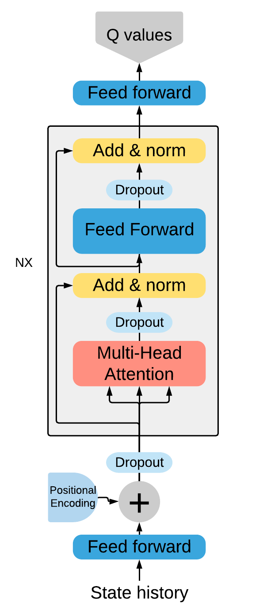

# TBQN
The code base for my Master thesis "Transformer based action sequence generation in reinforcement learning settings". It includes fully modularized code to train, Hp optimize and evaluate a DQN agent with a Transformer based architecture as its network (TBQN). The basic network structure is depicted below.



## Getting Started

This repository includes the following useful things: 

  - Fully modularized code to Run a DQN agent with a Transformer based architecture as its network (TBQN). 
  - Simple scripts to run TBQN with a mountain of different Parameters and model variations.
  - Scripts to perform parameter optimization for TBQN using the Optuna Library
  - The code and the results of the experiments I conducted during my thesis work.
  - Notebooks that can be used to evaluate and display either single model performance or whole studies.


## Build on

* [TF-agents](https://github.com/tensorflow/agents) - The  RL library used
* [Optuna](https://optuna.org/) - The HP optimization library

### Installing

To install dependencies simply run

```
pip install -r requirements.txt
```
You should be good to go. 


  
  
## Example usage

 To run an experiment or a study simply run one of the scripts like this: 
 ```
 python experiment_script_3.py --output_dir Acrobot-v1 --env Acrobot-v1   
  ```
  Parameters can be added and changed accordingly to the script.
  
 
 To evaluate the results of an experiment simply load your results into Result_display.ipynb. 
 Inside the Notebook specify the saved experiment path:
 ```
 directory = "experiment_scripts/example_result"
 ```

To evaluate the results of a study use Study_display.ipynb. or Study_display_2.ipynb.
 
 ## Authors

* **Gideon Stein** - *Initial work* - [Github](https://github.com/Gideon-Stein)


## Comments

* I am currently working on an PPO version which is not finished yet. Therefore, PPO named files are not finalized neither complete. They should be ignored.
* Due to storage I cannot include concrete studies and model runs in this repository. If you are interested in anything additional data, feel free to write me. 
